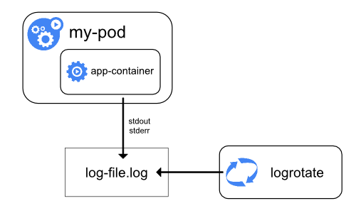

# Evaluate cluster and node logging

## Master Node(s)

### ETCD

Usually, most etcd implementations also include etcdctl, which can aid in monitoring the state of the cluster. If you’re unsure where to find it, execute the following:

`find / -name etcdctl`


Leveraging this tool to check the cluster status:


```bash
./etcdctl cluster-health

member 17f206fd866fdab2 is healthy: got healthy result from https://master-0.etcd.cfcr.internal:2379
```


The cluster this was executed on has only one master node, hence only one result from the script. You will normally receive a response for each etcd member in the cluster.

Alternatively, leverage kubectl get componentstatuses:


```
kubectl get componentstatuses

NAME                 STATUS    MESSAGE             ERROR
scheduler            Healthy   ok                   
controller-manager   Healthy   ok                   
etcd-1               Healthy   {"health":"true"}    
etcd-0               Healthy   {"health":"true"} 
```


### Kube-apiserver

This is dependent on the environment for which the Kubernetes platform has been installed on. For systemd based systems:

```bash
journalctl -u kube-apiserver
```
Or

```bash
cat /var/log/kube-apiserver.log
```

Or for instances where Kube-APIserver is running as a static pod:

```
kubectl logs kube-apiserver-k8s-master-03 -n kube-system
```


### Kube-Scheduler

For systemd-based systems

```bash
journalctl -u kube-scheduler
```

Or

```bash
cat /var/log/kube-scheduler.log
```

Or for instances where Kube-Scheduler is running as a static pod:

```bash
kubectl logs kube-scheduler-k8s-master-03 -n kube-system
```


### Kube-Controller-Manager

For systemd-based systems

```
journalctl -u kube-controller-manager
```

Or

```
cat /var/log/kube-controller-manager.log
```

Or for instances where Kube-controller manager is running as a static pod:

```
kubectl logs kube-controller-manager-k8s-master-03 -n kube-system
```


## Worker Node(s)

## CNI

Obviously this is dependent on the CNI in use for the cluster you’re working on. However, using Flannel as an example:

```bash
journalctl -u flanneld
```

If running as a pod, however:

```shell
Kubectl logs --namespace kube-system <POD-ID> -c kube-flannel
kubectl logs --namespace kube-system weave-net-pwjkj -c weave
```


### Kube-Proxy

For systemd-based systems

```shell
journalctl -u kube-proxy
```

Or

```shell
cat /var/log/kube-proxy.log
```

### Kubelet

```shell
journalctl -u kubelet
```

Or

```shell
cat /var/log/kubelet.log
```

### Container Runtime

Similarly to the CNI, this depends on which container runtime has been deployed, but using Docker as an example:

For systemd-based systems:

```shell
journalctl -u docker.service
```

Or

```shell
cat /var/log/docker.log
```

Hint : list the contents of `etc/systemd/system `if it’s a systemd-based service (containerd.service may be here)

## Cluster Logging

At a cluster level, `kubectl get events` provides a good overview.

#  Understand how to monitor applications

This section is a bit open-ended as it highly depends on what you have deployed and the topology of an application. Typically, however, we have a application that runs as a number of inter-connected **microservices**, consequently we monitor our applications by monitoring the underlying objects that comprise it, such as:

* Pods
* Deployments 
* Services
* etc

## Manage container stdout & stderr logs



Kubernetes handles and redirects any output generated from a containers stdout and stderr streams. These get directed through a logging driver which influences where to store these logs. Different implementations of Docker differ (such as RHEL's implementation) but commonly, these drivers will write to a file in json format:

```shell
root@ubuntu:~# docker info | grep "Logging Driver"
 Logging Driver: json-file
```

# Troubleshoot application failure

# Troubleshoot cluster component failure

Covered in "Evaluate cluster and node logging"

# Troubleshoot networking

